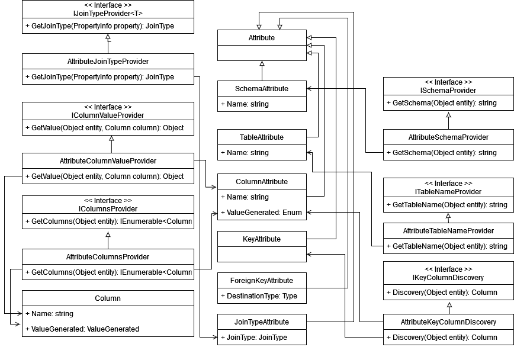
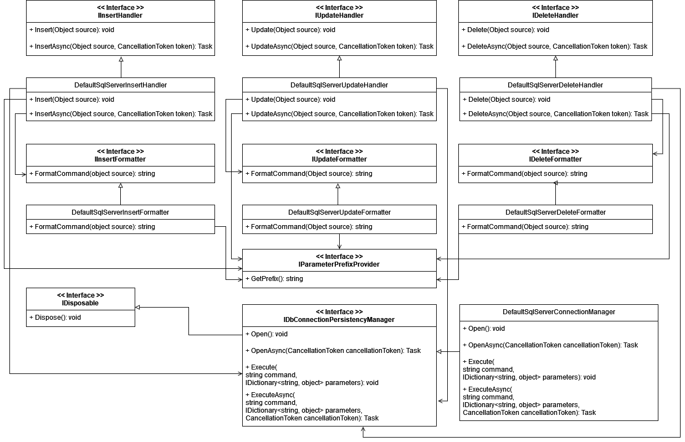
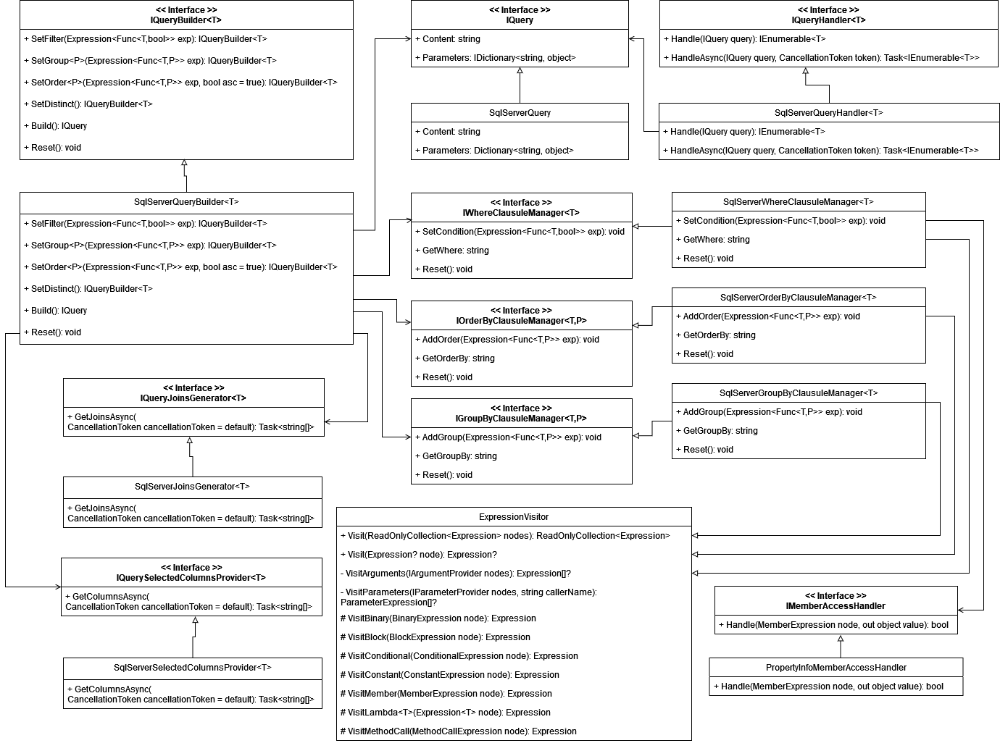

## EntityMT

## What is?

Entity MT is a multi-tenant and multi-DBMS data persistence component implemented in .NET 6 (C# language). It was developed using SOLID principles, design patterns and component segregation best practices.

## Structure (UML components diagram)

. __Tenant (Abstraction) and Tenant (Implementation):__ Responsible for providing the current tenant and the respective connection string for the DBMS.  
. __Configuration (Abstraction) and Configuration (Implementation):__ Responsible for providing the necessary settings for generating SQL queries and commands from/to objects. 
. __Persistency (Abstraction) and Persistency (Implementation):__ Responsible for creating, formatting and handling insert, update and delete SQL commands from objects. Additionally, it relies on the unit of work pattern to ensure atomicity. 
. __Query (Abstraction) and Query (Implementation):__ Responsible for creating SQL queries (selects) from LINQ and parse it to mapped objects.

### Tenant assemblies classes (Uml class diagram)

. __ITenantProvider Interface:__ This interface is responsible for providing ITenant object with the help of the respective factory. By default, tenant is created from "TENANT_ID" and "TENANT_NAME" http headers 
. __IConnectionStringProvider Interface:__ This interface is responsible for providing correct connection string for DBMS from ITenant object. 
__Note:__ Factory was adopted to cover possible extensions to the ITenant interface that were not initially envisaged.

### Configuration assemblies classes (Uml class diagram)

The classes of this assembly are divided into two groups, the attributes, which correspond to the settings and their providers (aiming to include other configuration methods outside the attributes). 
. __SchemaAttribute:__ Configuration about the database schema (how data is organized within a relational database) of the objects. This attribute is used at class level. 
. __TableAttribute:__ Configuration that map the database table to object. This attribute is used at class level. 
. __ColumnAttribute:__ Configuration that map the table database columns to properties of the objects.   
. __KeyAttribute:__ Configuration that map the primary key column to object property.  
. __ForeignKeyAttribute:__ Configuration that map foreign key column to object property.  
. __JoinTypeAttribute:__ Configuration that map join type (cross, left, right and inner) to the objects relationships.

### Persistency assemblies classes (Uml class diagram)

The classes of this assembly are divided into two groups too, the handlers that execute the commands and the formatters, that mount them. These responsibilities were separated to enable the implementation of unit and integration tests (low coupling). 
In addition, it is also worth mentioning the 'IDbConnectionPersistencyManager' interface, which is responsible for managing connections with the DBMS.

### Queries assemblies classes (Uml class diagram)

This essembly has, basically, two major main responsibilities, being the execution and mount of the queries. 
The execution of queries is centered on the 'IQueryHandler' interface. Here the finished query, corresponding to the 'IQuery' interface, is executed on the database. 
The mount proccess of queries is more complex and, therefore, this responsibility was segregated. With this, we can customize how queries are mounted in parts (columns, joins and/or clausules) and advance the solution based on ISO/IEC 25010 quality stands. 
Below is possible to observe each interface linked to the process of mounting the queries: 

. __IQueryBuilder__: Corresponds to the pattern builder and is used by clients to build queries. With clients using only this interface, communication between objects becomes simpler and facilitates future refactorings (Eric Evans addresses this a lot in the book 'DDD: Tackling Complexity in the Heart of Software').
. __IWhereClausuleManager__:
. __IOrderByClausuleManager__:
. __IGroupByClausuleManager__:
. __IMemberAccessHandler__:
. __IQueryJoinsGenerator__:
. __IQuerySelectedColumnsProvider__:

## Supported DBMS

. Sql Server.
